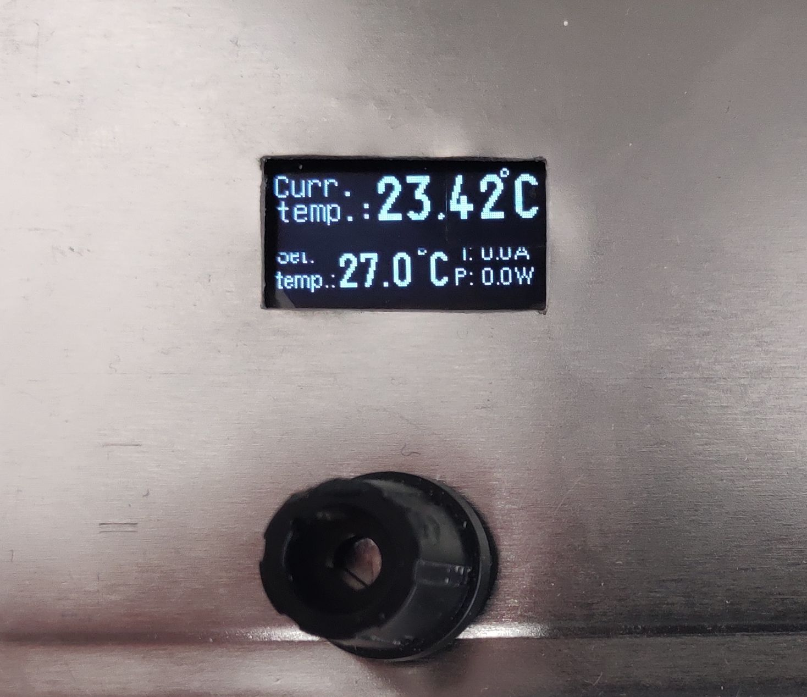

# Temperature Controller - FW

This is a firmware for [Temperature Controller hardware](https://github.com/norbertg1/Temperature_Controller-HW) written in C with [STM32CubeIDE](https://www.st.com/en/development-tools/stm32cubeide.html) developement environment.

#Menu Structure

With rotating the knob you can change the values. Pushing it you move over the menu points.

- **Menu 1** - Current temperature, output power and current are displayed
    - Set the desired temperature
- **Menu 2** - Options
    - Set Kp const.
    - Set Kd const.
    - Set Ki const.
    - Set max. Power
    - Set mode (cooling or heating)
    - Choose NTC type
    - Set PWM output frequency (currently the HW doesn support)
- **Menu 3** - Options
    - Set temp. offset
- **Menu 4** - Like menu 1, but you can directly set the output power in %
    - Set output PWM duty
- **Menu 5** - Set defaults
    - With long pressing the knob you can restore all values to its defaults
\
\
Menu1:
    